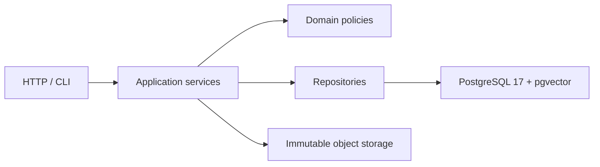

# Ayin-e Emtedad Platform

A production-oriented, versioned platform for preserving Ayin-e Emtedad,
modeling Manasek, researching external knowledge, and eventually producing
evidence-grounded Persian, English, and Arabic lectures.

The repository currently contains the completed Phase 1 platform foundation.
It does not yet import or model Ayin, Manasek, external sources, retrieval data,
or generated lectures.

## Authority and current source status

The platform keeps these zones separate:

1. `AYIN_CANON`
2. `AYIN_WORKING`
3. `MANASEK_CANON`
4. `MANASEK_WORKING`
5. `EXTERNAL_PRIMARY`
6. `EXTERNAL_DERIVED`
7. `GENERATED_CONTENT`

The supplied `Ayin_Emtedad_Baznevisi_Shodeh.pdf` is `AYIN_WORKING`. The supplied
`Manasek_V1.pdf` is `MANASEK_WORKING`. Neither source is automatically Canon.
A later editorial approval must create a versioned approved state and retain
historical versions.

Ayin remains separate from external knowledge because external evidence may
support, challenge, illustrate, or parallel an Ayin inquiry without redefining
Ayin. Manasek remains separate from lecture content because ritual is an
optional experiential layer with its own safety and consent requirements, not
evidence that proves Ayin.

## Phase 1 architecture

The initial system is a modular monolith with one FastAPI application and one
PostgreSQL 17 source of truth.



PostgreSQL namespaces reserve explicit ownership boundaries:

| Schema | Future owner |
|---|---|
| `core` | Ayin documents, ontology, terminology, and editorial versions |
| `ritual` | Manasek structures, versions, and safety policy |
| `knowledge` | External sources, segments, claims, and provenance |
| `retrieval` | Search material, embeddings, runs, and evaluation |
| `content` | Research, lecture, localization, and publication artifacts |
| `ops` | Operational assets, jobs, audit, review, and cache infrastructure |

Phase 1 creates only these empty schemas and enables pgvector. It creates no
future-domain tables or vector indexes.

## Prerequisites

- `uv` 0.12 or newer
- Docker with Docker Compose
- Git

The initial supported runtime is CPython 3.13. The repository's
`.python-version` lets `uv` select it automatically.

## Local setup

Create the locked Python environment:

```bash
uv sync --all-groups --frozen
```

Copy `.env.example` to `.env` for local development, or export the same
variables in your shell. `.env` is ignored and must never be committed.

The example credentials are intentionally local-only. They are not production
secrets and must not be reused outside the development Compose service.

## PostgreSQL and pgvector

Validate and start the pinned PostgreSQL 17/pgvector service:

```bash
docker compose config
docker compose pull db
docker compose up -d db
docker compose ps
```

Apply and inspect migrations:

```bash
uv run alembic upgrade head
uv run alembic current
uv run alembic check
```

The baseline migration is reversible on a disposable database. It intentionally
retains the cluster-level `vector` extension during downgrade because the
migration cannot prove exclusive ownership of a shared extension.

## Run the application

With settings loaded from `.env` or the environment:

```bash
uv run uvicorn app.main:create_app --factory --host 127.0.0.1 --port 8000 --no-access-log
```

Probe health:

```bash
curl --fail http://127.0.0.1:8000/health/live
curl --fail http://127.0.0.1:8000/health/ready
```

`/health/live` verifies only the process. `/health/ready` verifies database
connectivity, PostgreSQL major version 17, pgvector, and all six namespaces. It
returns HTTP 503 without exposing connection details when a dependency fails.

## Docker application image

The Dockerfile excludes source PDFs, tests, local storage, Git data, and secrets
from its build context.

```bash
docker build -t emtedad-platform:phase1 .
```

Deployment topology and production object storage remain open review items; the
Compose file therefore runs only the required local database service.

## Immutable local storage

`LocalObjectStore` streams bytes to a private temporary location, calculates
SHA-256, fsyncs the completed file, and publishes it with a non-overwriting
atomic link. Storage keys are generated from the digest. Duplicate bytes reuse
the same object, while corrupt conflicts, traversal, and symlink escapes fail
explicitly.

Original bytes stay outside PostgreSQL. Later phases will add typed,
foreign-keyed domain association tables; no generic `owner_type`/`owner_id`
relationship is used.

## Verification

Run the quality and unit checks:

```bash
uv run ruff format --check .
uv run ruff check .
uv run mypy app tests
uv run pytest tests/unit -q
```

With the migrated Compose database and `EMTEDAD_DATABASE_URL` configured, run:

```bash
uv run pytest tests/integration -q
uv run pytest -q
```

The integration suite creates a uniquely named disposable database for its
upgrade/downgrade/re-upgrade test and drops it afterward. It does not downgrade
the developer database.

## Project map

```text
app/
  api/routes/       Thin system HTTP routes
  core/             Typed configuration and explicit exceptions
  db/               Metadata, async sessions, and readiness checks
  ops/              Structured logging
  storage/          Immutable-object storage port and local adapter
alembic/             Baseline migration and environment
tests/
  unit/              Dependency-free foundation behavior
  integration/       PostgreSQL and migration behavior
docs/                Specifications, architecture, ADRs, audits, and plans
```

## Known limitations and roadmap

- Rights, production deployment, backups, privacy, and editorial authorization
  remain documented review items.
- Authentication, workers, cloud storage, and production operations are not yet
  implemented.
- Phase 2 will introduce the versioned Ayin Working/Canon data model and importer
  only after its plan is reviewed.
- Later phases add Manasek, external ingestion, retrieval, dialogue, research,
  Semantic Masters, multilingual localization, publishing, and evaluation in
  that order.
- Codex CLI, YouTube ingestion, embeddings, RAG, lecture generation,
  localization, Canon revision impact analysis, and publishing commands do not
  exist yet. The README will document them only after their owning phases pass.

See `docs/execution/MASTER_PLAN.md` for program status and
`docs/execution/CURRENT_PHASE.md` for the active approved phase.
