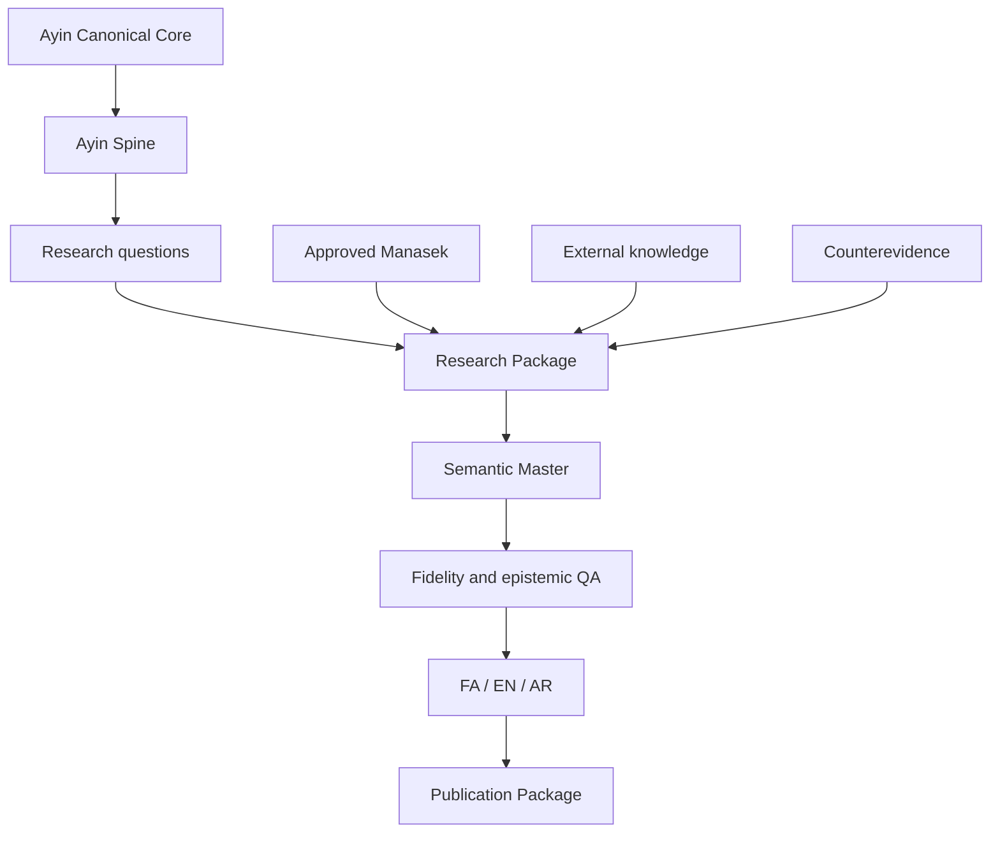
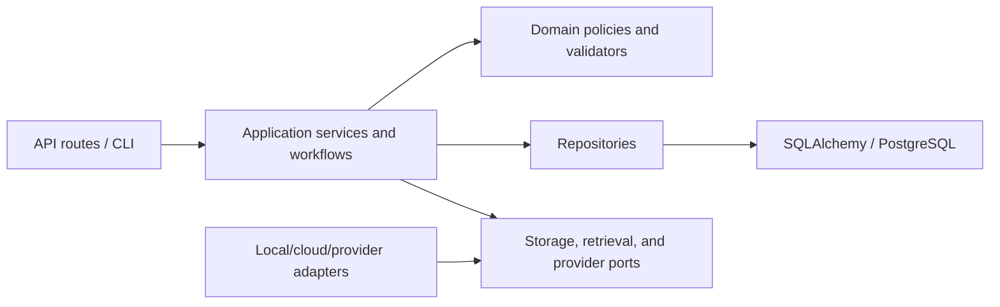
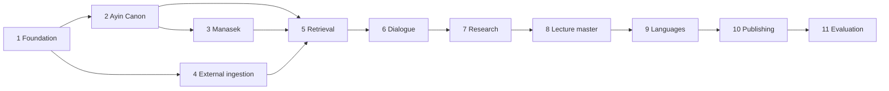

# System Architecture

## Architectural intent

The platform preserves epistemically different bodies of information without
collapsing them into one vector store or undifferentiated RAG corpus. Ayin
defines the conceptual center; Manasek provides an optional experiential layer;
external knowledge contributes evidence, criticism, and dialogue; publication
outputs remain derived artifacts.

The initial system is a modular monolith: one deployable FastAPI application,
one PostgreSQL source of truth, and explicit module and PostgreSQL-schema
boundaries. This is not a license to couple domains through route handlers or
shared untyped tables. Splitting deployments is deferred until measured scale,
security, or ownership requirements justify it.

## End-to-end flow

## Bounded domains and schema ownership

| PostgreSQL schema | Application boundary | Responsibility | Must not do |
|---|---|---|---|
| `core` | `app/core/` | Ayin documents, passages, concepts, distinctions, principles, open questions, terminology, and editorial versions | Accept generated or external content as Canon automatically |
| `ritual` | `app/ritual/` | Manasek documents, families, gates, stages, Returns, collective structures, versions, concept links, localizations, and safety policy | Act as evidence proving Ayin or mix individual and collective structures |
| `knowledge` | `app/knowledge/` | External creators, sources, segments, claims, references, resolution, quality metadata, and provenance | Redefine canonical Ayin concepts or promote extraction candidates to fact |
| `retrieval` | `app/retrieval/` | Chunks, search representations, model/configuration identities, embeddings, retrieval runs, lanes, and evaluation data | Rank all authority zones as one undifferentiated corpus |
| `content` | `app/research/` and `app/lectures/` | Ayin Spines, research plans/packages, Semantic Masters, citations, localizations, series, publication, and dependency state | Write directly into Canon or mutate frozen research snapshots |
| `ops` | `app/ops/`, `app/db/`, and `app/storage/` | Jobs, audit, review infrastructure, configuration, database lifecycle, immutable assets, cache metadata, and operational errors | Become a generic owner table that erases domain referential integrity |

`content` is shared by the research and lecture modules because those modules
own different steps of one versioned artifact chain. They interact through
typed services and persisted IDs, not by importing private implementation
details from one another.

## Dependency direction

- Routes validate transport data, invoke a service, and translate explicit
  results or exceptions. They contain no business rules.
- Domain policies and validators do not import FastAPI, database sessions, or
  provider clients.
- Repositories own persistence queries for their domain. Cross-domain access is
  through public repository/service interfaces and explicit foreign keys.
- Provider and storage adapters depend on protocols owned by the application,
  so external services remain replaceable.
- A workflow may coordinate domains but cannot weaken their validation or
  approval rules.

## Retrieval lanes

Retrieval must expose, at minimum:

1. Ayin Canon retrieval;
2. external evidence retrieval;
3. counterevidence and alternative retrieval;
4. optional, approved Manasek retrieval.

Each lane applies its own authority, version, language, and publication filters
and returns provenance. Fusion occurs only after corpus zone and epistemic-role
labels are retained. Similarity score never determines philosophical authority.

## Technical foundation

- Python 3.11 or newer, with the exact supported and production versions pinned
  and tested by the project;
- FastAPI with Pydantic schemas at HTTP and provider boundaries;
- PostgreSQL 17 with pgvector and PostgreSQL full-text search;
- SQLAlchemy 2 and Alembic with explicit naming conventions and schema-aware
  migrations;
- object-storage protocol for immutable original files and media, with a safe
  local implementation first and cloud adapters later;
- idempotent jobs with typed states, deterministic keys, explicit attempts, and
  transactional state changes;
- structured, secret-safe logs, request/job correlation, explicit exceptions,
  and audit events;
- LangGraph only if Phase 7 demonstrates a need for durable, checkpointed
  orchestration. Workflows remain LangGraph-compatible without requiring it in
  earlier phases.

Phase 1 creates only the foundation and database namespaces. Domain tables and
adapters land in their owning phases; empty future-module scaffolding is
avoided.

## Runtime and trust boundaries

The initial runtime has four trust boundaries:

1. **HTTP/CLI inputs:** validate size, type, language/locale, identifiers, and
   authorization before invoking services.
2. **PostgreSQL:** the relational source of truth for identities, versions,
   states, dependencies, and provenance. Constraints defend invariants even
   when application validation is bypassed.
3. **Object storage:** holds immutable bytes outside PostgreSQL. Database rows
   store checksum, size, media type, storage key, and provenance; safe adapters
   prevent path escape and partial publication.
4. **External providers and subprocesses:** treat responses as untrusted input,
   use timeouts and schemas, redact secrets, and preserve provider/run identity.
   Codex CLI execution must use argument arrays and never `shell=True`.

Background execution begins with a database-backed job contract. A distributed
queue or separate worker deployment requires measured need and an ADR; it is
not assumed in Phase 1.

## Transactions, idempotency, and failure behavior

- A service owns the transaction for one business operation; repositories do
  not commit independently behind the service's back.
- Raw objects are written by content hash and finalized atomically before their
  database reference becomes available.
- Idempotency keys include the immutable input identity plus relevant importer,
  prompt, model, or configuration version.
- Retrying a stage reuses successful immutable outputs and records each attempt;
  it does not infer success from a file's mere existence.
- Failures are explicit and observable. Domain validation failures are not
  swallowed or converted to publishable states.

## Versioning and reproducibility

- Raw sources are immutable and checksum-addressed.
- Canon and Manasek use explicit documents and immutable approved versions.
- Structured entities pin their source/version and passage locations.
- Retrieval artifacts identify normalization, chunking, embedding, lexical,
  fusion, and reranking configuration versions.
- Research Packages freeze the evidence and canonical versions used.
- Lectures refer to one Semantic Master and pinned Research Package.
- Localizations preserve concept, claim, citation, and epistemic identities.
- Canon or source changes mark affected outputs for review without rewriting
  history.

## Human governance

AI-produced extraction, relation, lecture, and localization output is a draft or
candidate until the owning policy permits approval. Review queues expose
uncertain entity resolution, terminology, proposed Ayin-external relations,
Canon and ritual changes, citation gaps, fidelity failures, localization drift,
and source corrections or retractions.

Important domain relations use typed tables with real foreign keys. Operational
audit events may record a descriptive target locator, but they are not used as
the authoritative relationship between domain entities.

## Phase sequencing

This diagram expresses implementation dependencies, not authority. Manasek
never becomes evidence for Ayin, and external knowledge never becomes Canon
because it arrived earlier or scored higher.
